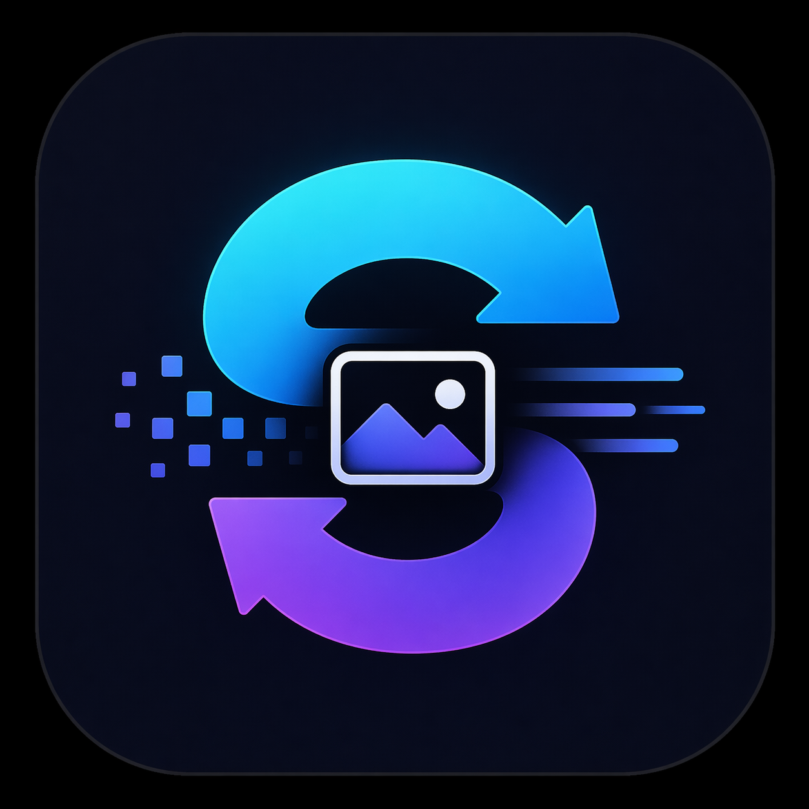
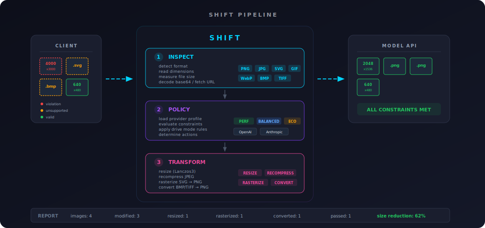

<p align="center">
  
</p>

<h1 align="center">SHIFT</h1>

<p align="center">
  <strong>Smart Hybrid Input Filtering & Transformation</strong>
</p>

<p align="center">
  A multimodal preflight layer that automatically adapts inputs before they reach an AI model.
</p>

---

## What it does

SHIFT sits between your application and the model API. Every request passes through a pipeline that **inspects**, **evaluates**, and **transforms** media inputs so they conform to provider constraints.

<p align="center">
  
</p>

**Before SHIFT:** oversized images, unsupported formats, and bloated payloads cause hard failures (400 errors, token waste, session crashes).

**After SHIFT:** every request is valid, optimized, and tuned to your cost/quality preference.

## Install

```bash
cargo install --path shift-cli
```

Or build from source:

```bash
cargo build --release
# Binary at target/release/shift
```

## Quick start

```bash
# Transform an OpenAI request (stdin/stdout pipe)
cat request.json | shift -p openai -m balanced > safe_request.json

# Transform an Anthropic request from a file
shift request.json -p anthropic -m economy > safe_request.json

# See what would change without modifying anything
shift request.json --dry-run -o report

# Compose with curl
shift request.json -p openai | curl -s -X POST \
  https://api.openai.com/v1/chat/completions \
  -H "Authorization: Bearer $OPENAI_API_KEY" \
  -H "Content-Type: application/json" \
  -d @-
```

## Options

```
shift [OPTIONS] [FILE]

Arguments:
  [FILE]  Input file (JSON request payload). Reads stdin if omitted.

Options:
  -p, --provider <PROVIDER>  Target provider [default: openai]
                              [openai, anthropic, claude]
  -m, --mode <MODE>          Drive mode [default: balanced]
                              [performance, balanced, economy]
      --svg-mode <MODE>      SVG handling [default: raster]
                              [raster, source, hybrid]
  -o, --output <FORMAT>      Output format [default: json]
                              [json, report, both]
      --dry-run              Show what would change without modifying
      --profile <FILE>       Custom provider profile JSON
      --model <MODEL>        Target model (overrides model in payload)
  -v, --verbose              Verbose output
```

## Drive modes

| Mode | What it does |
|---|---|
| **performance** | Minimal transforms. Only enforce hard provider limits (max dimension, max file size). Preserve original fidelity. |
| **balanced** | Moderate optimization. Resize oversized images, recompress bloated files. Remove obvious waste. **Default.** |
| **economy** | Aggressive optimization. Downscale everything to 1024px, drop excess images beyond provider limits, minimize token usage. |

## SVG handling

Most AI model APIs reject SVG. SHIFT detects SVG inputs and handles them based on `--svg-mode`:

| Mode | Behavior |
|---|---|
| **raster** | Rasterize SVG to PNG via `resvg` (default, provider-safe) |
| **source** | Replace the image with SVG XML as a text content block |
| **hybrid** | Rasterize to PNG and retain SVG source as text |

## Supported formats

**Detected and processed:**

| Category | Formats |
|---|---|
| Raster images | PNG, JPEG, GIF, WebP, BMP, TIFF |
| Vector images | SVG (auto-rasterized to PNG) |
| Encodings | base64 data URIs, raw base64, URL references |

BMP and TIFF are auto-converted to PNG. SVGs are rasterized. Everything else passes through if it meets provider constraints.

## Provider profiles

Built-in constraints for the two major multimodal providers:

| Provider | Max images | Max dimension | Max file size | Megapixel limit |
|---|---|---|---|---|
| **OpenAI** | 10 | 2048 px | 20 MB | -- |
| **Anthropic** | 20 | 8000 px | 5 MB | 1.15 MP |

Profiles include per-model overrides (gpt-4o, gpt-4.1, claude-sonnet-4, etc.) and fall back to provider defaults for unknown models.

Custom profiles can be loaded with `--profile custom.json`.

## Library usage

SHIFT is split into two crates: `shift-core` (library) and `shift-cli` (binary). The library can be used directly in Rust applications:

```rust
use shift_core::{pipeline, ShiftConfig, DriveMode};
use serde_json::json;

let payload = json!({
    "model": "gpt-4o",
    "messages": [{
        "role": "user",
        "content": [{
            "type": "image_url",
            "image_url": {"url": "data:image/png;base64,..."}
        }]
    }]
});

let config = ShiftConfig {
    mode: DriveMode::Balanced,
    provider: "openai".to_string(),
    ..Default::default()
};

let (safe_payload, report) = pipeline::process(&payload, &config).unwrap();
eprintln!("{}", report); // what changed and why
```

## How it works

1. **Inspect** -- Detect every image in the request payload. Extract format (via magic bytes), dimensions, file size, encoding type. Handles base64 data URIs, raw base64, and URL references (fetched automatically).

2. **Evaluate** -- Load the provider profile for the target API. Compare each image's metadata against the constraints. Apply mode-specific rules to determine what actions are needed (resize, recompress, convert, rasterize, drop).

3. **Transform** -- Execute the actions. Resize preserves aspect ratio using Lanczos3 filtering. SVGs are rasterized with `resvg` (supports gradients, text, viewBox). BMP/TIFF are converted to PNG. JPEG recompression uses mode-tuned quality levels.

4. **Reconstruct** -- Rebuild the original payload with transformed images slotted back in. Output is a valid JSON request ready to send to the API.

## Project structure

```
shift/
├── shift-core/          Library crate (all processing logic)
│   └── src/
│       ├── inspector/   Format detection, metadata extraction
│       ├── policy/      Provider profiles, constraint evaluation, rules
│       ├── transformer/ Image resize, recompress, SVG rasterize, convert
│       ├── payload/     OpenAI + Anthropic message format parse/reconstruct
│       ├── pipeline.rs  Orchestrator: inspect -> policy -> transform
│       ├── report.rs    Transformation report
│       └── mode.rs      DriveMode, SvgMode, ShiftConfig
├── shift-cli/           Binary crate (CLI interface)
├── profiles/            Provider constraint JSON (embedded at compile time)
└── tests/fixtures/      Test images and sample payloads
```

## Roadmap (v2+)

- **Video**: frame sampling, keyframe extraction, resolution downscale
- **Audio**: compression, transcription to text
- **Documents**: chunking, summarization, text extraction
- **Smart image selection**: near-duplicate detection, keep most informative
- **Caption fallback**: replace low-value images with text descriptions
- **Adaptive policies**: dynamic adjustment based on request size and latency targets

## License

Apache-2.0
